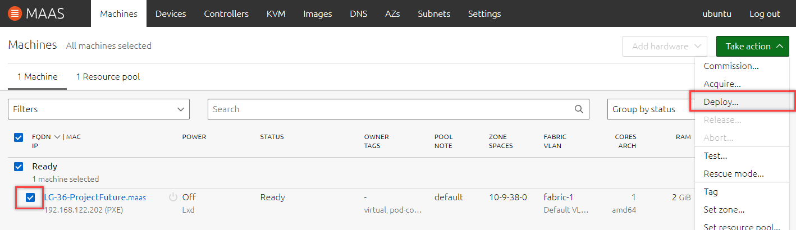

# AE1
*Ich kann VMs für Services einsetzen*

## 1. Anbieter

Als erstes muss der Anbieter für die VM definiert werden. In unserem Fall haben wir folgende drei Cloud Anbieter zur verfügung:
- AWS Amazon Cloud
- Azure Microsoft Cloud
- Maas TBZ Cloud

    In diesem Beispiel beziehen wir uns auf den Anbieter Maas. Grundsätzlich sind die funktionalitäten bei allen Cloud Anbietern gleich.

## 2. VM erstellen

Um eine neu VM zu erstellen gehen wir im MAAS in unseren KVM (Die Kernel-based Virtual Machine ist eine Infrastruktur des Linux-Kernels zur Virtualisierun)[^1]

Sobald man beim gewünschten KVM ist, kann man eine neue VM erstellen (compose VM)

Beim erstellen füllt man die Pflichtfelder aus und wenn gewünscht Optionale ebenfalls ändern.

Pflichtfelder:
- Hostname
- Domain
- Zone
- Ressourcen Pool

Optional:
- Architecture
- Arbeitsspeicher RAM
- Cores

## 3. Den gewünschten Service per Cloud-Init Deployen

Sobald die VM die wir erstellt haben fertig gestellt wurde in bereit ist, müssen wir diese Deployen.
Dafür wählen wir die entsprechende VM aus und gehen unter "Take Action" --> "Deploy..."

Hier hat man die Möglichkeit das OS und die Version dazu auszuwählen. In unserem Falle wird dies Ubuntu 20.04 LTS sein.
Bei diesem Punkt muss man sich noch überlegeb, ob man den Service manuell installiert oder per Cloud-Init Data/File.

Folgende Möglichkeiten gibt es:
- Service nach dem Deployen manuell "ohne Cloud-Init Skript" einrichten
- Service automatisch per Cloud-Init Skript aufsetzen lassen

Wenn man dies fertig Deployd hat, muss man nurnoch abwarten bis die VM fertiggestellt wird.
In dem folgenden Bild sieht man, dass die VM noch in bearbeitung ist.

In diesem Beispiel verwendeter Cloud-Init Code:

                #cloud-config - Installiert den nginx Web Server
                packages:
                - nginx

## 4. Testing des Service

Je nach dem was für ein Service man installiert/eingerichtet hat, muss man oder kann man es auf andere Weise testen.

In unserem Fall wurde ein NGINX Web Server installiert.
Somit greiffen wir per Webbrowser darauf zu. Erwartet wird ein HTML Site "Welcome to nginx!".

___

[01_Grundlagen](../01_Grundlage)

[Startseite](https://github.com/ask-yo-girl-about-me/Project-Future)

[^1]: KVM Beschreibung [Wikipedia](https://de.wikipedia.org/wiki/Kernel-based_Virtual_Machine)