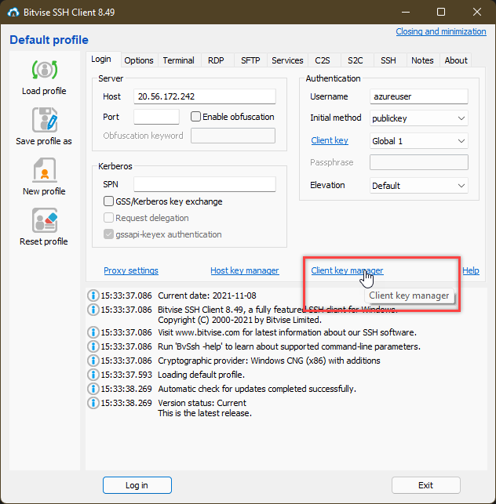

## AE2
*Ich kann selber (SSH) Public/Private Keys erstellen und einsetzen*

### 1. SSH erklärung
SSH beinhaltet eine Sichere Verbindung auf eine entferntes Gerät. Typisch dafür wäre ein Server, auf welcher man per remote command line zugreifft.
Wenn man sich über das Internet auf einer Maschine anmeldet oder auf der Maschiene irgenwelche Kommands durchführt wäre es möglich, das dies jemand abhören kann.
Genau um dies zu verhindern, verwendet man SSH mit einem Public und Privat Key. Was wir brauchen ist auf der Lokalen Maschine einen SSH Client Software und auf der Remot Maschine einen SSH Server Software vorinstalliert.

Linux und MAC Computer haben einen SSH Client schon vorinstalliert. Für Windows User gilt die Arbeit mit GitBash, Windows Subsystem oder Putty.

Die Maschine auf welche wir uns verbinden, enthält den "Public Key". Die Maschine mit der wir uns verbinden, also die Lokale, diese muss den Privat Key haben für den Verbindungsaufbau.
Wenn der Privat und Public Key übereinstimmen und korrekt sind, ist der Verbindungsaufbau gewährleistet.

### 2. Erstellen von Public/Privat Key
Um ein neuen Public oder Privat Key zu erstellen braucht es eine entsprechende Software zur erstellung.
In diesem Beispiel verwenden wir zur erstellung von SSH Keys den [Bitvise SSH Client](https://www.bitvise.com/ssh-client-download)

1. Bitvise öffnen
2. Unter Client Key Manager können wir neue Keys erstellen

3. Hier klicken wir auf "Create New"

4. Um einen neuen SSH Key zu erstellen müssen wir ein Kennwort eintragen

5. Somit haben wir nun einen neuen SSH Key erstellt. Nun müssen wir diesen nurnoch exportieren. Darum klicken wir den entsprechenden Key aus und gehen auf "Export".

6. Als erstes exportieren wir den "public key"

7. Zusätzlich direkt noch den "privat key"

### Einsetzen von SSH Keys
Das einsetzen von SSH Keys wir beim nächsten Lernziel gezeigt. Dort wird anhand von einem Beispiel gezeigt, wie man per SSH Key auf eine VM verbinden kann.

[01_Grundlagen](../01_Grundlage)

[Startseite](https://github.com/ask-yo-girl-about-me/Project-Future)