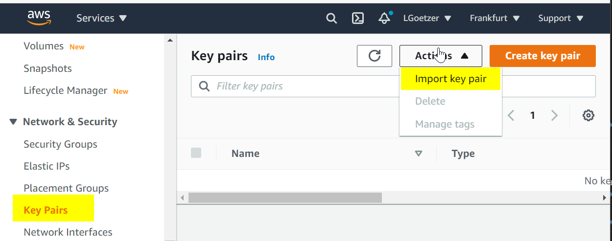
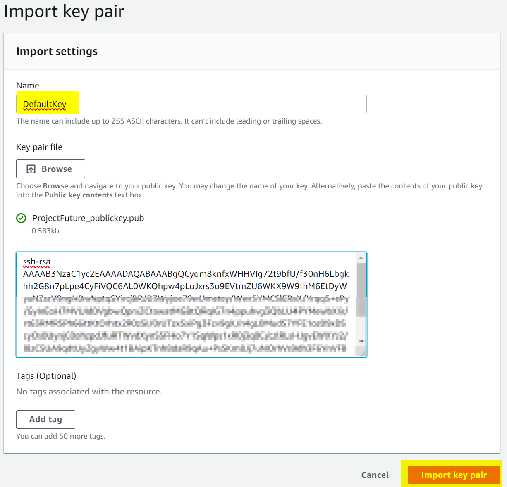
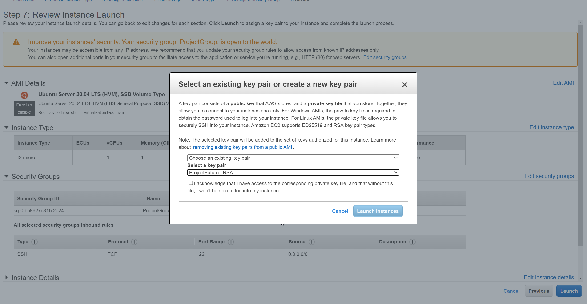
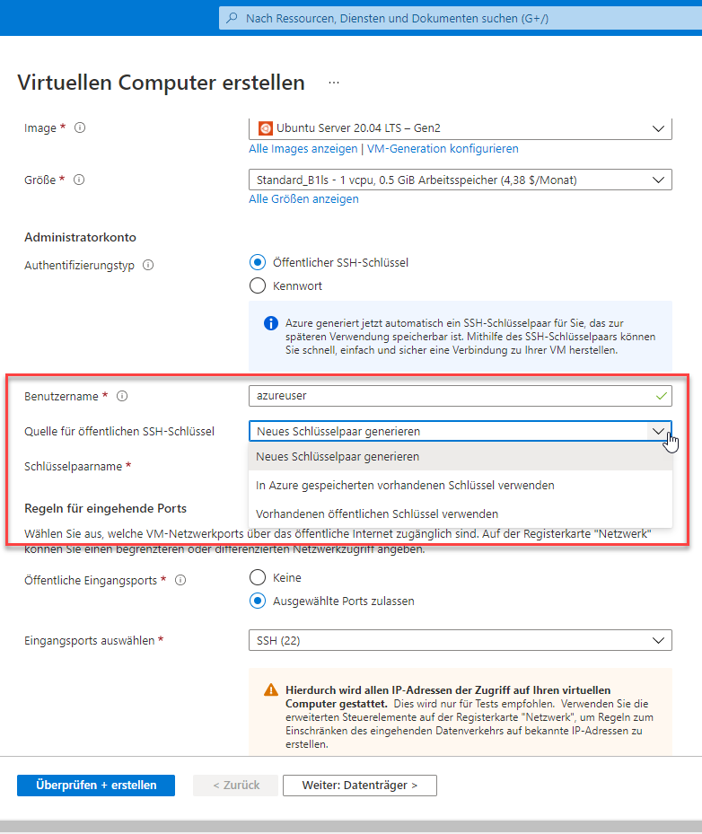
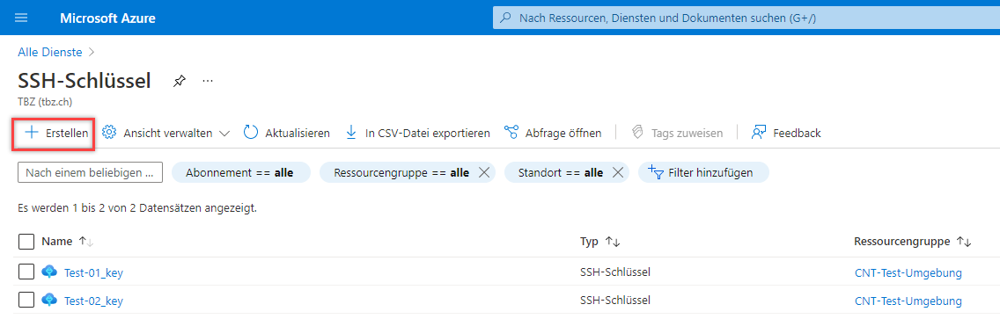
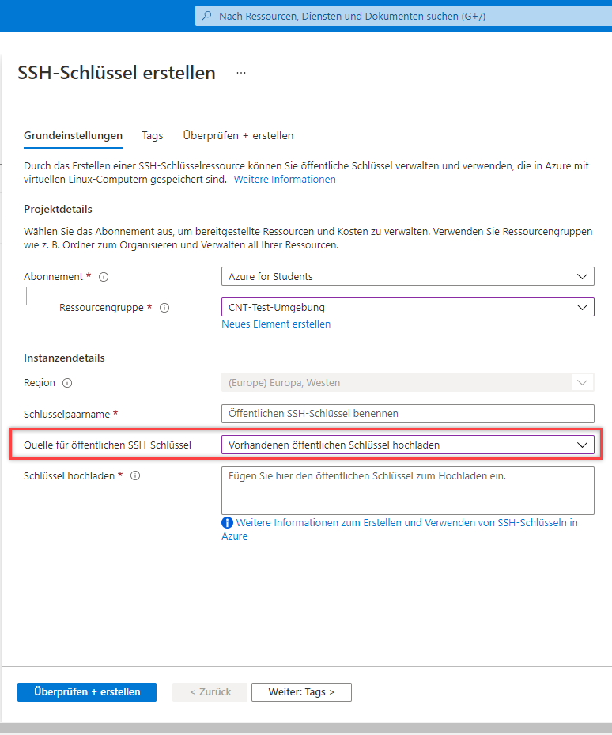
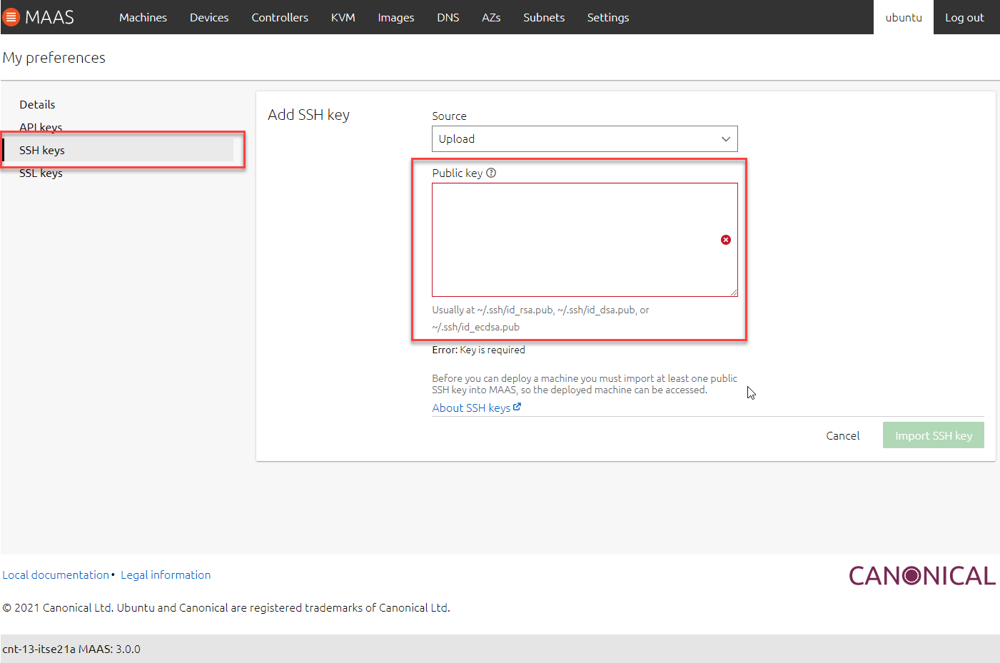

## AF3
*Ich kann einen SSH Key erstellen und diesen für die Verbindung zur VM verwenden*

### 1. Erstellen von SSH Keys
Das erstellen von einem SSH Key wurde bei Lernziel AE2 dokumentiert.

### 2. Verwendung eines SSH Keys zur Verbindung mit einer VM
1. Als erstes muss natürlich der SSH Key erstellt werden

2. Danach muss der Public Key beim einrichten der Virtuellen Maschine hinterlegt werden. Je nach Cloud Anbieter kann dies unterschiedlich sein. Dies wird über zwei Varianten gemacht. Entweder man fügt diesen in der Cloud unter seinem Konto hinzu oder man gibt diesen in einem Cloud-Init File mit. Die Verwendung mit dem Cloud-Init und SSH wird beim [Nächsten Kapitel](https://github.com/ask-yo-girl-about-me/Project-Future/tree/main/02_Automatisierung) beschrieben. Wie man diese in seinem Konto hinterlegt wir hier mit den drei verschieden Cloud Anbietern AWS, Azure und MAAS aufgezeigt.

Folgende Varianten gibt es für das Hinterlegen eines Public Keys:
- Direkte mitgabe eines Public Key beim erstellen einer VM
- Hinterlegen in den Einstellungen des entsprechenden Cloud Anbieters
- Per Cloud-Init mitgeben

**AWS:**

SSH Schlüssel in den Einstellungen hinterlegen um beim erstellen der VMs zu verwenden:

Beim erstellen einer VM kann man zwischen den zwei Optionen wechseln (Vorhanden oder neuer hinterlegen):

**Azure:**

SSH Schlüssel in den Einstellungen hinterlegen um beim erstellen der VMs zu verwenden:

Beim erstellen einer VM kann man zwischen den zwei Optionen wechseln (Vorhanden oder neuer hinterlegen):

**MAAS:**

___

[01_Grundlagen](../01_Grundlage)

[Startseite](https://github.com/ask-yo-girl-about-me/Project-Future)