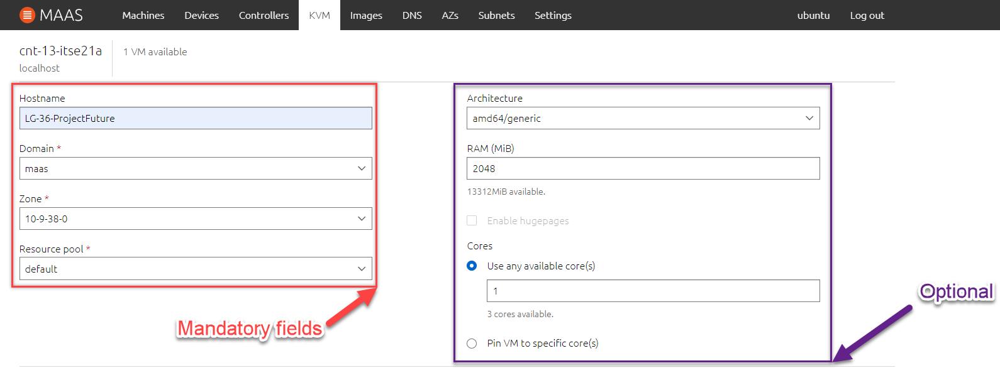

# Grundlage

## Lernziele
* [AE1: Ich kann VMs für Services einsetzen](#AE1)
* [AE2: Ich kann selber (SSH) Public/Private Keys erstellen und einsetzen](#AE2)
* [AF3: Ich kann einen SSH Key erstellen und diesen für die Verbindung zur VM verwenden](#AF3)
* [AE4: Ich kann Linux Pakete suchen und installieren](#AE4)
* [AE5: Ich kann Linux Befehle einsetzen und deren Funktion erklären](#AE5)

## AE1
Ich kann VMs für Services einsetzen

### 1. Anbieter

Als erstes muss der Anbieter für die VM definiert werden. In unserem Fall haben wir folgende drei Cloud Anbieter zur verfügung:
- AWS Amazon Cloud
- Azure Microsoft Cloud
- Maas TBZ Cloud

    In diesem Beispiel beziehen wir uns auf den Anbieter Maas. Grundsätzlich sind die funktionalitäten bei allen Cloud Anbietern gleich.

### 2. VM erstellen

Um eine neu VM zu erstellen gehen wir im MAAS in unseren KVM (Die Kernel-based Virtual Machine ist eine Infrastruktur des Linux-Kernels zur Virtualisierun)[^1]

Sobald man beim gewünschten KVM ist, kann man eine neue VM erstellen (compose VM)

Beim erstellen füllt man die Pflichtfelder aus und wenn gewünscht Optionale ebenfalls ändern.

Pflichtfelder:
- Hostname
- Domain
- Zone
- Ressourcen Pool

Optional:
- Architecture
- Arbeitsspeicher RAM
- Cores

### 3. Den gewünschten Service per Cloud-Init Deployen

Sobald die VM die wir erstellt haben fertig gestellt wurde in bereit ist, müssen wir diese Deployen.
Dafür wählen wir die entsprechende VM aus und gehen unter "Take Action" --> "Deploy..."

Hier hat man die Möglichkeit das OS und die Version dazu auszuwählen. In unserem Falle wird dies Ubuntu 20.04 LTS sein.
Bei diesem Punkt muss man sich noch überlegeb, ob man den Service manuell installiert oder per Cloud-Init Data/File.

Wenn man dies fertig Deployd hat, muss man nurnoch abwarten bis die VM fertiggestellt wird.
In dem folgenden Bild sieht man, dass die VM noch in bearbeitung ist.

                #cloud-config - Installiert den nginx Web Server
                packages:
                - nginx

### 4. Testing des Service

Je nach dem was für ein Service man installiert/eingerichtet hat, muss man oder kann man es auf andere Weise testen.

In unserem Fall wurde ein NGINX Web Server installiert.
Somit greiffen wir per Webbrowser darauf zu. Erwartet wird ein HTML Site "Welcome to nginx!".

## AE2
Ich kann selber (SSH) Public/Private Keys erstellen und einsetzen

### SSH erklärung
SSH beinhaltet eine Sichere Verbindung auf eine entferntes Gerät. Typisch dafür wäre ein Server, auf welcher man per remote command line zugreifft.
Wenn man sich über das Internet auf einer Maschine anmeldet oder auf der Maschiene irgenwelche Kommands durchführt wäre es möglich, das dies jemand abhören kann.
Genau um dies zu verhindern, verwendet man SSH mit einem Public und Privat Key. Was wir brauchen ist auf der Lokalen Maschine einen SSH Client Software und auf der Remot Maschine einen SSH Server Software vorinstalliert.

Linux und MAC Computers haben einen SSH Client schon vorinstalliert. Für Windows User gilt die Arbeit mit GitBash, Windows Subsystem oder Putty.

### Erstellen von Public/Privat Key
Um ein neuen Public oder Privat Key zu erstellen braucht es eine entsprechende Software zur erstellung.
In diesem Beispiel verwenden wir zur erstellung von SSH Keys den [Bitvise SSH Client](https://www.bitvise.com/ssh-client-download)

1. Bitvise öffnen
2. Unter Client Key Manager können wir neue Keys erstellen

3. Hier klicken wir auf "Create New"

4. Um einen neuen SSH Key zu erstellen müssen wir ein Kennwort eintragen

5. Somit haben wir nun einen neuen SSH Key erstellt. Nun müssen wir diesen nurnoch exportieren. Darum klicken wir den entsprechenden Key aus und gehen auf "Export".

6. Als erstes exportieren wir den "public key"

7. Zusätzlich direkt noch den "privat key"

### Automatischer SSH Key beim erstellen der VM auf der Clodu

## AF3
Ich kann einen SSH Key erstellen und diesen für die Verbindung zur VM verwenden

### 

## AE4
Ich kann Linux Pakete suchen und installieren

###

## AE5
Ich kann Linux Befehle einsetzen und deren Funktion erklären

##

Quelle: [Kompetenz Matrix](https://gitlab.com/ch-tbz-hf/Stud/cnt/-/tree/main/1_Kompetenzmatrix#matrix)

[Startseite](https://github.com/ask-yo-girl-about-me/Project-Future)

[^1]: KVM Beschreibung [Wikipedie](https://de.wikipedia.org/wiki/Kernel-based_Virtual_Machine)