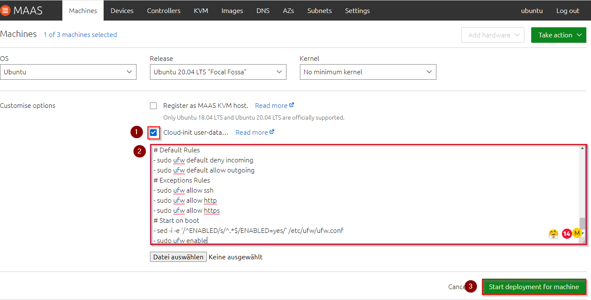
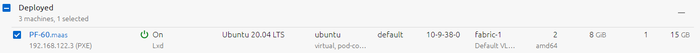
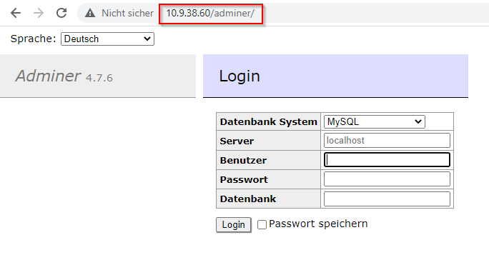
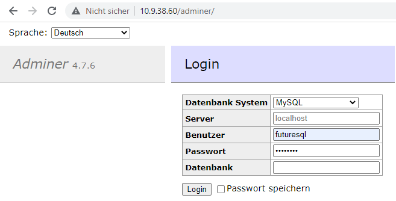
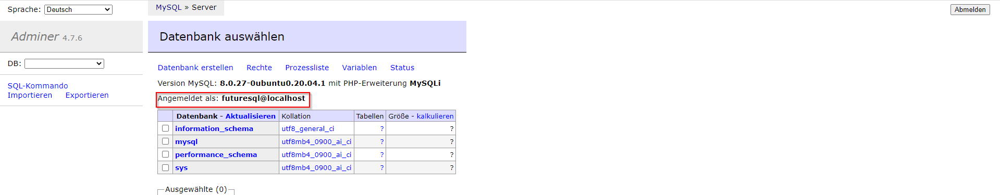

# BE2
*Ich kann VMs mit eigenen Cloud-init Scripten aufsetzen*

## VM Aufsetzten mit Cloud-init Script

Auf setzen einer VM mit einem Cloud-init Scritp zeigen wir mittels der MAAS Cloud.

Die VM ist bereits schon erstellt gemässt Schritt [AE1](https://github.com/ask-yo-girl-about-me/Project-Future/blob/main/01_Grundlage/AE1.md).

### VM Aufsetzen

Im MAAS-Portal unter dem Menüpunkt "Machines" sind die bereitserstellten VMs aufgelistet.

1. Bereitgestellte VM auswählen
2. Aktionsmenü öffnen
3. "Deploy..." Auswählen

### Cloud-init Scrip einfügen

Als nächster Schritt kann das OS ausgewählt werden und die Option, dass mit Cloud-init Scritp die VM aufgesetzt werden kann.

1. Aufsetzen mit Cloud-init Script aktivieren
2. Nun kann das Cloud-init Script eingefügt werden
3. Danach mit "Start deployment for machine" weiterfahren

### Deployed

Das Aufsetzen der VM dauert nun ein paar Minuten. Sobald die VM aufgesetzt ist, erscheint diese unter dem Menüpunkt "Machines" mit dem Status Deployd.

### VM Webzugriff Test

Das Cloud-init Script hat auf der VM einen SQL-Server installiert mittels Webzugriff per "Adminer".
Für den Test öffnen wir nun den Browser und öffnen den Link http://10.9.38.60/adminer.

### VM SQL Benutzer Test

Zusätzlich haben wir im Script einen User definiert der Zugriff auf den SQL-Server hat.

- Benutzer:   futuresql
- Passwort:   password

Wie man in der Unteren Grafikerkennen kann, hat das Anmelden mit dem User geklappt.

___

[BE3](hhttps://github.com/ask-yo-girl-about-me/Project-Future/blob/main/02_Automatisierung/BE3.md)

[02_Automatisierung](../02_Automatisierung)

[Startseite](https://github.com/ask-yo-girl-about-me/Project-Future)