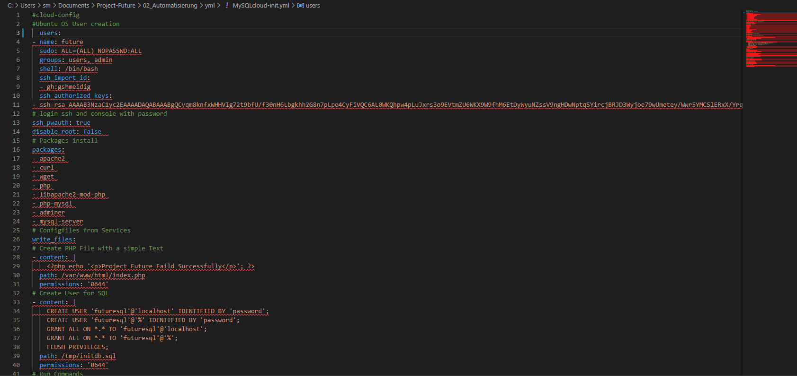
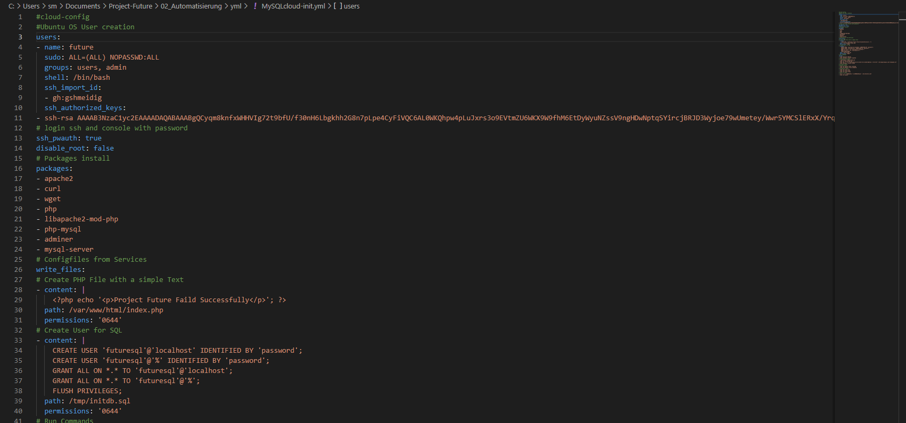

# BE4
*BE4: Ich kann eine valide YAML Datei erstellen, z.B. mit VSCode*

## Was ist YAML

*YML Dateien werden von Entwicklern verwendet, da sie Quellcode enthalten, der in der Programmiersprache YAML (YAML Ain't Markup Language) geschrieben wurde. ... Daher können YML Dateien mit vielen anderen Dateien verwendet werden, die Quellcode in verschiedenen Sprachen wie C, C#, C++, Java, PHP und anderen enthalten.* [^1]

Die Vadierung der YAML Datei kann auf meheren Arten getestet weden.
Wir haben die folgenden möglichkeiten verfolgt:

## YAML Datei Validierung mit Visual Studio Code

Wir haben in der Gruppe beschlossen mit VSCode zu arbeiten. VSCode ist Code Editor welcher auf verschienden Plattformen unterstüzt wird.
Zusätlich bittet VSCode sehr viel erweiterungen für diverse Programmiersprachen an. Nach kurzer Suche sind wir auch schon fündig geworden.
Die Erweiterung "YAML" überprüft das Scritp und markiert allenfals die Fehler.

Fehler Beispiel:

Bei obigen Fehlerbeispiel, ist auf der dritten Zeile der User zu weit eingerückt. Mit der erweiterung erkennt VSCode das ab der dritten Zeile die Hierarchie im YAML-Code nicht mehr stimmt.
Wen mann einen einrückung weg nimmt, herscht im wieder eine Hierarchie gemäss YAML-Code.

Korrigertes Beispiel:

## YAML Validator per Web

Auf der online Website [yamllint](http://www.yamllint.com/) könnte man sein Code ebenfalls überprüfen lassen.

___

[02_Automatisierung](../02_Automatisierung)

[03_Cloud-Services](../03_Cloud-Services/)

[Startseite](https://github.com/ask-yo-girl-about-me/Project-Future)

[^1]: Beschreibung Yaml [Online-Convert](https://www.online-convert.com/de/datei-format/yml)