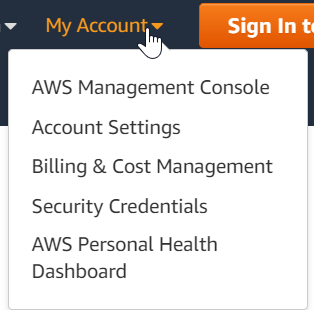

# CE2
*Ich kann Cloud CLI Tools einsetzen und habe diese mit Beispielen Dokumentiert*

## Azure 

Die Azure CLI ist ein mächtiges Tool mit dem ganz einfach mehrere Ressourcen auf einmal deployed werden können, hat man sich erstmals ein gutes Template zurechtgelegt, können zukünftige VM's so ganz einfach provisioniert werden. 

Alle Informationen zur Installation der Azure CLI wird [hier](https://docs.microsoft.com/en-us/cli/azure/install-azure-cli-windows?tabs=azure-cli/) beschrieben. 

Dazu haben wir für die Azure Cloud ein PowerShell Skript erstellt, welches die folgenden Punkte abhandelt: 
- Definierung aller Variablen die benötigt werden
- Login zur Azure Cloud
- Prüfen ob die in den Variablen definierte Subscription existiert
- Prüfen ob der definierte RessourceGruppenName schon exisitert, falls nicht wird die Gruppe angelegt.
- Prüfen ob die benötiten lokalen Files wie Cloud Init & SSH Publickeys im spezifizierten Ordner existieren. 
- Erstellen der VM
- Öffnen der benötigten Ports

                #define Variables
                $localfilespath = "C:\Temp\Test" #define where the files are stored on the local computer, example C:\Temp
                $subscriptionID = "cd850118-9efa-4191-8e32-4c8fe15bd1df" #enter the subscription ID of your Azure subscription
                #enter the name of your RG
                $VMName = "TestX" #Name of your VM
                $RessourceGroupName = "RG-$($VMName)"
                $image = "UbuntuLTS" #the image defines the OS which is going to be installed CentOS / Ubuntu
                $size = "Standard_B1ls" #The size defines the ressource plan which is used. 
                $username = "futureuser" #The administrator username for the VM
                $sshpublickey = "$localfilespath\ProjectFuture_publickey.pub"
                $cloudinitfile = "$localfilespath\Apachecloud-init.yml"

                #performing login to AZ CLI
                az login

                #checking if subscription exists
                $subscriptioncheck = az account list --query "[?id=='$subscriptionid']"
                $subscriptionexist = $subscriptioncheck.Length -gt 0 
                if (!$subscriptionexist)
                    {
                        Write-Output "The specified subscription $($subscriptionID) does not exist!"
                    }
                else 
                    {
                        Write-Output "The specified subscription $($subscriptionID) does exist!"
                    }

                #checking if the specified ressource group already exists
                $RGcheck = az group list --query "[?name=='$RessourceGroupName']"

                If ($RGcheck -eq "false")
                    {
                        Write-Output "The RessourceGroup $($RessourceGroupName) does not exist... Creating RG...  "
                        az group create --name $RessourceGroupName --location westeurope --subscription $subscriptionID
                    }
                else
                    {
                        Write-Output "The RessourceGroup $($RessourceGroupName) does  exist!"
                    }

                #check if the specified files exist

                    #check if the source folder exists
                    If (Test-Path $localfilespath)
                        {
                            Write-Output "The path exists...  "

                            #check if the Public key exists
                            If (Test-Path $sshpublickey)
                                {
                                    Write-Output "The Public Key file exists"
                                }
                            else 
                                {
                                    Write-Error "The SSH Key file does not exist"
                                }
                            
                            #check if the cloud init file exists
                            If (Test-Path $cloudinitfile)
                                {
                                    Write-Output "The Cloud init file does exist"
                                }
                            Else
                                {
                                    Write-Error "The Cloud init file does't exist!"
                                }
                        }
                    else
                        {
                            Write-Output "The Path does not exist"
                        }

                Write-Output "Creating VM..... "

                #create VM
                az vm create --name $VMName --resource-group $RessourceGroupName --subscription $subscriptionID --image $image --size $size --admin-username $username --ssh-key-values $sshpublickey --public-ip-sku Standard --custom-data $cloudinitfile

                Write-Output "VM has been provisioned"

                Write-Output "Opening required ports"
                #open ports
                az vm open-port -g $RessourceGroupName -n $VMName --port 80,443 --priority 310

## Amazon 

Die Amazon Cloud verfügt ebenfalls über eine CLI, die Informationen zur Installation sind [hier](https://aws.amazon.com/cli/) zu finden. 
Nachdem die CLI installiert wurde, müssen wir einen Access Key & Secret anlegen: 

Wir klicken auf *My Security Credentials* 

Anschliessend muss ein neuer Credential angelegt werden

Klick man auf *Show Access Key* kann man die Details des Keys sehen

Als nächstes geht es darum sich mit der AWS Cloud zu verbinden. Dies wird mittels dem Command **aws configure** gemacht. 
Anschliessend werden 4 Parameter verlangt: 
- AWS Access Key ID --> Die ID des Keys den wir soeben erstellt haben.
- AWS Secrete Access Key --> Den Secret Access Key den wir soeben angelegt haben. 
- Default region name --> Dies definiert die Default region, in dieser Region werden die Ressourcen dann auch angelegt. In unserem Fall **eu-central-1**
- Default Output format --> Das Default Output format definiert  wie die Values zurückkommen, in unserem Fall **text**

Ob die Connection zu AWS erfolgreich hergestellt wurde, kann mittels dem Command **aws sts get-caller-identity** überprüft werden: 

Als nächstes müssen wir eine Security Gruppe anlegen, Security Gruppen beinhalten die In & Outbound Rules für die VM. 
Im folgenden Beispiel erstellen wir eine Security Gruppe mit folgenden Eigenschaften: 
- Name: ProjectGroup
- Description: Used for the Project
- Öffnen der Ports 22 (SSH) & 80 (HTTP) für Inbound Rules

                aws ec2 create-security-group --group-name ProjectGroup --description "Used for the Project" 
                aws ec2 authorize-security-group-ingress --group-name ProjectGroup --protocol tcp --port 22 --cidr 0.0.0.0/0 
                aws ec2 authorize-security-group-ingress --group-name ProjectGroup --protocol tcp --port 80 --cidr 0.0.0.0/0

Nun da die Security Group angelegt wurde. Kann mit der Erstellung der VM begonnen werden. 
Der nachfolgende Command erstellt eine VM mit folgenden Parametern: 
- --image-id --> Die Image ID ist die ID des Images in unserem Fall: Ubuntu Server ami-0629230e074c580f2
- --security-groups-ids --> gibt an mit welcher Security Group die VM verlinkt werden soll. 
- --instance-type --> definiert in welches pricing tier die VM installiert wird. 
- --count --> gibt an wie viele VM's provisioniert werden sollen
- --userdata --> Gibt den Pfad zum cloud init file an. 

                aws ec2 run-instances --image-id ami-0629230e074c580f2 --security-group-ids ProjectGroup --instance-type t2.micro --count 1 --user-data file://C:/Temp/cloud-init.cfg

Sobald der Command ausgeführt wurde, wird die VM provisioniert: 

___

[03_Cloud-Services](../03_Cloud-Services)

[Startseite](https://github.com/ask-yo-girl-about-me/Project-Future)