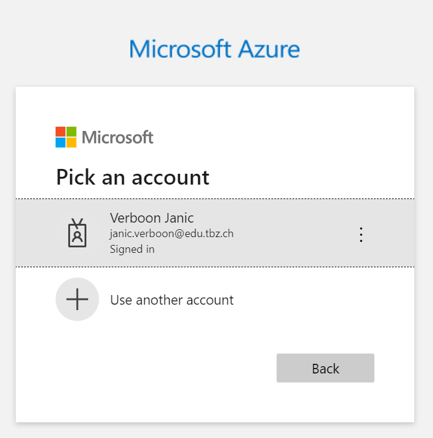

# Cloud Services

## Lernziele
* [CE1: Ich kann die Cloud Services einsetzen](#CE1)
* [CE2: Ich kann Cloud CLI Tools einsetzen und habe diese mit Beispielen Dokumentiert](#CE2)
* [CE3: Ich kann mittels Lift und Reshape Services in die Cloud verschieben, mit Dokumentation](#CE3)
* [CE4: Ich kann VMs auf mindestens 3 Cloud erstellen](#CE4)

## CE1
Ich kann die Cloud Services einsetzen

## CE2
Ich kann Cloud CLI Tools einsetzen und habe diese mit Beispielen Dokumentiert

### Azure 

Als erstes muss man sich zur Azure Cloud connecten. 
Dies geschieht via dem Command az login

Nachdem wir uns mit unseren TBZ credentials angemeldet haben, können wir damit beginnen mittels CommandoZeilen Tools Ressourcen anzulegen. 

Dazu haben wir für die Azure Cloud ein PowerShell Skript erstellt: 

                #define Variables
                $localfilespath = "C:\Temp" #define where the files are stored on the local computer, example C:\Temp
                $subscriptionID = "cd850118-9efa-4191-8e32-4c8fe15bd1df" #enter the subscription ID of your Azure subscription
                $RessourceGroupName = "FirstTest" #enter the name of your RG
                $VMName = "TestX" #Name of your VM
                $image = "UbuntuLTS" #the image defines the OS which is going to be installed CentOS / Ubuntu
                $size = "Standard_B1ls" #The size defines the ressource plan which is used. 
                $username = "futureuser" #The administrator username for the VM
                $sshpublickey = "$localfilespath\ProjectFuture_publickey.pub"
                $cloudinitfile = "$localfilespath\test.txt"

                #performing login to AZ CLI
                az login

                #checking if subscription exists
                $subscriptioncheck = az account list --query "[?id=='$subscriptionid']"
                $subscriptionexist = $subscriptioncheck.Length -gt 0 
                if (!$subscriptionexist)
                    {
                        Write-Output "The specified subscription $($subscriptionID) does not exist!"
                    }
                else 
                    {
                        Write-Output "The specified subscription $($subscriptionID) does exist!"
                    }

                #checking if the specified ressource group already exists
                $RGcheck = az group list --query "[?name]=='$RessourceGroupName'"
                $RGexists = $RGcheck.Length -gt 0 

                If (!$RGexists)
                    {
                        Write-Output "The RessourceGroup $($RessourceGroupName) does not exist... Creating RG...  "
                        az group create --name $RessourceGroupName --location westeurope --subscription $subscriptionID
                    }
                else{
                        Write-Output "The RessourceGroup $($RessourceGroupName) does  exist!"
                    }

                #check if the specified files exist

                    #check if the source folder exists
                    If (Test-Path $localfilespath)
                        {
                            Write-Output "The path exists...  "

                            #check if the Public key exists
                            If (Test-Path $sshpublickey)
                                {
                                    Write-Output "The Public Key file exists"
                                }
                            else 
                                {
                                    Write-Error "The SSH Key file does not exist"
                                }
                            
                            #check if the cloud init file exists
                            If (Test-Path $cloudinitfile)
                                {
                                    Write-Output "The Cloud init file does exist"
                                }
                            Else
                                {
                                    Write-Error "The Cloud init file does't exist!"
                                }
                        }
                    else
                        {
                            Write-Output "The Path does not exist"
                        }

                Write-Output "Creating VM..... "

                #create VM
                az vm create --name $VMName --resource-group $RessourceGroupName --subscription $subscriptionID --image $image --size $size --admin-username $username --ssh-key-values $sshpublickey --public-ip-sku Standard

                Write-Output "VM has been provisioned"

                Write-Output "Opening required ports"
                #open ports
                az vm open-port -g $RessourceGroupName -n $VMName --port 80,443 --priority 310

## CE3
Ich kann mittels Lift und Reshape Services in die Cloud verschieben, mit Dokumentation

## CE4
Ich kann VMs auf mindestens 3 Cloud erstellen

Quelle: [Kompetenz Matrix](https://gitlab.com/ch-tbz-hf/Stud/cnt/-/tree/main/1_Kompetenzmatrix#matrix)

[Startseite](https://github.com/ask-yo-girl-about-me/Project-Future)
