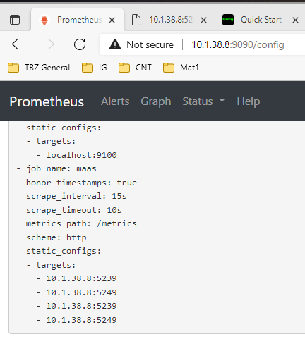
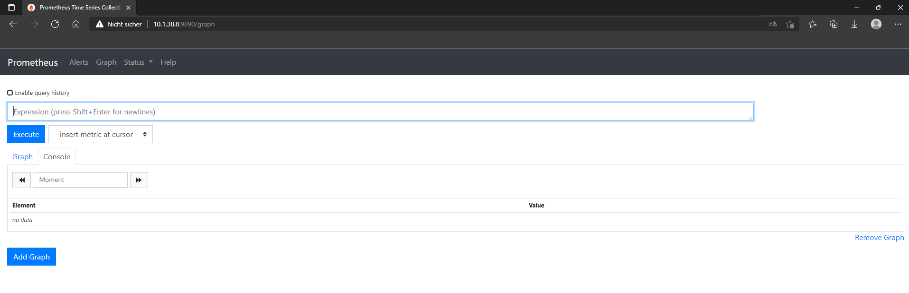

# DE2
*Ich kann weitergehende Konzepte von Maas.io einsetzen, wie Region Controller, VLANs, Monitoring etc.*

## Monitoring im Allgemeinen

Monitoring im allgemeine bedeute nichts anders als beobachtung eines bestimmten Systems.

*Eine Funktion des Monitorings besteht darin, bei einem beobachteten Ablauf oder Prozess festzustellen, ob dieser den gewünschten Verlauf nimmt und bestimmte Schwellwerte eingehalten werden, um andernfalls steuernd eingreifen zu können. Monitoring ist deshalb ein Sondertyp des Protokollierens.*

## Monitoring im Bezug auf das MAAS

MAAS-Dienste können Prometheus-Endpunkte für die Erfassung von Leistungsmetriken bereitstellen. Dazu gehören fünf Endpunkte, die für MAAS-Benutzer besonders interessant sind:

1. TFTP server file transfer latency
2. HTTP requests latency
3. Websocket requests latency
4. RPC calls (between MAAS services) latency
5. Per request DB queries counts

## Aktivieren von Prometheus-Endpunkten

Bei einer Debian-basierten MAAS-Installation installiert man die Bibliothek und starten die MAAS-Dienste wie folgt neu:

                sudo apt install python3-prometheus-client
                sudo systemctl restart maas-rackd
                sudo systemctl restart maas-regiond

MAAS bietet auch optionale Statistiken über Ressourcen, die auf dem MAAS-Server selbst registriert sind. Dazu gehören vier große Kategorien von Informationen:

1. Die Anzahl der Knoten nach Typ, Bogen, ...
2. Anzahl der Netze, Räume, Fabrics, VLANs und Subnetze
3. Gesamtzahl der CPU-Kerne, Arbeitsspeicher und Speicher für Maschinen
4. Zähler für VM-Host-Ressourcen

Nachdem man die Python3-Prometheus-Client-Bibliothek wie oben beschrieben installiert hat, führen man Folgendes aus, um die Statistik zu aktivieren:

Statt der Umgebungsvariable, könnt Ihr "ubuntu" verwenden.

                maas login ubuntu http://localhost:5240/MAAS/api/2.0

                maas ubuntu maas set-config name=prometheus_enabled value=true

## Konfiguration Prometheus

Nach dem durchführen der oben gennanten Schritte, konnten wir den Metrics Tab auf dem Maas erreichen. 

              http://10.1.38.8:5240/MAAS/metrics
              
Allerdings war der Prometheus Client unter **http://10.1.38.8:9090** nicht erreichbar. 
Auch der Service war nicht gelistet unter **service prometheus status** 

Also haben wir den kompletten Prometheus client installiert 

              sudo apt install prometheus

Anschliessend war dann die Prometheus Oberfläche auch verfügbar.
Wir haben dann mittels nano noch das Maas ins Prometheus Monitoring aufgenommen: 

             sudo nano /etc/prometheus/prometheus.yml
            
              
             - job_name: maas
               static_configs:
                - targets:
                  - 10.1.38.8:5239  # for regiond
                  - 10.1.38.8:5249  # for rackd
                  - 10.1.38.8:5239  # regiond-only
                  - 10.1.38.8:5249  # rackd-only

Annschliessend war dann das MAAS Teild es Prometheus Monitorings: 

Wenn die MAAS-Installation mehrere Knoten umfasst, muss die Zieleinträge entsprechend angepasst werden, um die auf den einzelnen Knoten bereitgestellten Dienste abzugleichen.

---
**INFO**

Im Falle eines Multi-Host-Einsatzes reicht es aus, eine einzelne IP für jeden der MAAS-Hosts, auf denen regiond läuft, hinzuzufügen.

---

## Einsatz von Prometheus und Grafana

Grafana und Prometheus lassen sich problemlos mit Juju bereitstellen.

Das MAAS-Performance-Repository bietet ein Beispiel für ein Deploy-Stack-Skript, mit dem der Stack auf LXD-Containern bereitgestellt und konfiguriert werden kann.

Zunächst müssen Sie Juju über installieren:

                sudo snap install --classic juju

Dann können Sie das Skript aus dem Repo ausführen:

                grafana/deploy-stack <10.1.38.8>

Um den Fortschritt der Bereitstellung zu verfolgen, führen Sie Folgendes aus:

                watch -c juju status --color

Sobald man alles bereitgestellt hat, ist die Grafana-Benutzeroberfläche über Port 3000 mit den Anmeldeinformationen admin/grafana zugänglich. Die Prometheus-Benutzeroberfläche ist auf Port 9090 verfügbar.

Das Repository bietet auch einige Beispiel-Dashboards, die die häufigsten Anwendungsfälle für Diagramme abdecken. Diese sind unter grafana/dashboards verfügbar. Man kan diese über die Grafana-Benutzeroberfläche oder die API importieren.

Prometheus-Benutzeroberfläche   = http://10.1.38.8:9090

Grafana-Benutzeroberfläche      = http://10.1.38.8:3000

Das ganze sieht dann so aus:

[Prometheus](http://10.1.38.8:9090/graph)

___

[Lernziel DE2](../04_Private-Cloud/DE2.md)

[Nächstes Lernziel DE3](../04_Private-Cloud/DE3.md)

[04_Private-Cloud](../04_Private-Cloud)

[Startseite](https://github.com/ask-yo-girl-about-me/Project-Future)
