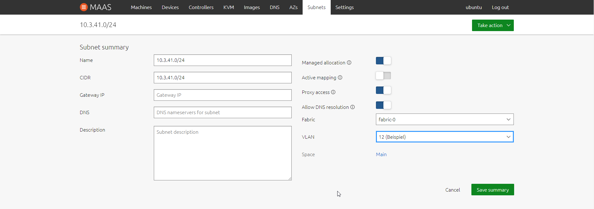

# DE2
*Ich kann weitergehende Konzepte von Maas.io einsetzen, wie Region Controller, VLANs, Monitoring etc.*

## VLANs

Sie können VLANs grundsätzlich auf zwei Arten implementieren:

- Als Portbasierte VLANs (untagged)
- Als Tagged VLANs

**Portbasierte VLANs**

Mit portbasierten VLANs unterteilen Sie einen einzelnen physischen Switch einfach auf mehrere logische Switche. Im folgenden Beispiel teilen wir einen physischen 8-Port Switch (Switch A) auf zwei logische Switches auf:

Verbindung der zwei VLANs der beiden physischen Switche. Bei portbasierten VLANs sind hier zwei Kabel nötig.

**Tagged VLANs**

Bei tagged VLANs können mehrere VLANs über einen einzelnen Switch-Port genutzt werden. Die einzelnen Ethernet Frames bekommen dabei Tags angehängt, in dem jeweils die VLAN-ID vermerkt ist zu dessen VLAN das Frame gehört. Wenn im gezeigten Beispiel beide Switches tagged VLANs beherrschen, kann damit die gegenseitige Verbindung mit einem einzelnen Kabel erfolgen:

## Einrichten VLANs auf dem MAAS

Die VLANs können über den Tab Subnets über Add angelegt werden. Erfasst werden muss ein Name (fett) und eine eindeutige Nummer zwischen 2 - 4094. Anschliessend sind die Subnetze, zu den VLAN zu erfassen.

Die so definierten VLANs können dann den VMs über den Tab Network mittels Add alias or VLAN zugewiesen werden.

Hier wird nun das Subnet 10.3.41.0/24 erstellt. 

Hier werden die VLANs erstellt. Gemäss Beispiel im Bild die Nummer 12.

Nun wird das Subnet dem vorherig erstellten VLAN zugewiesen.

Nach dem Subnet zuweisen, muss das VLAN noch editiert werden. Die IP Adressen Ranges muss definiert werden.

Sobald diese Schritte erfolgreich durchgespielt wird, sieht man unter der Registerkarte "Subnet" eine übersicht der VLANs.

Das zuweisen des VLANs einer VM muss vor dem Deployment gemacht werden. Dies kann unter den VM-Einstellungen in der Registerkarter Network konfiguriert werden. Beim Physikalischen-Adapter kann unter "Action" die Option "Add-VLAN" ausgewählt werden. Nun kann man das gewünschte VLAN zuweisen, dabei ist es wichtig, dass wir eine Statische IP-Adresse verteilen, da keine DHCP-Rolle auf dem VLAN existiert.

Für den Test habe wir (siehe Bild unten) links das Terminal von der VM "xyz-11-kunden" und rechts das Terminal von der VM "xyz-10-Lieferanten". Bei beiden ist die VLAN Konfiguration ersichtlich, sobald man den Netzwerkstatus mit dem Befehl "ifconfig" abruft. Auf dem linken Terminal (VM "xyz-11-kunden) ist ebenfalls ersichtlich das die VM "xyz-10-Lieferanten" per ping über VLAN erreichbar ist.

___

[Monitoring](../04_Private-Cloud/DE2_Monitoring.md)

[Lernziel DE2](../04_Private-Cloud/DE2.md)

[04_Private-Cloud](../04_Private-Cloud)

[Startseite](https://github.com/ask-yo-girl-about-me/Project-Future)
