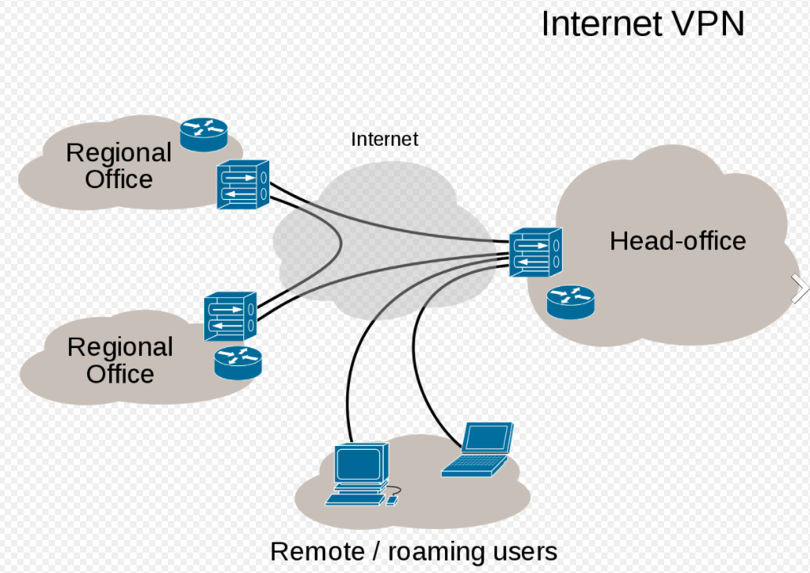
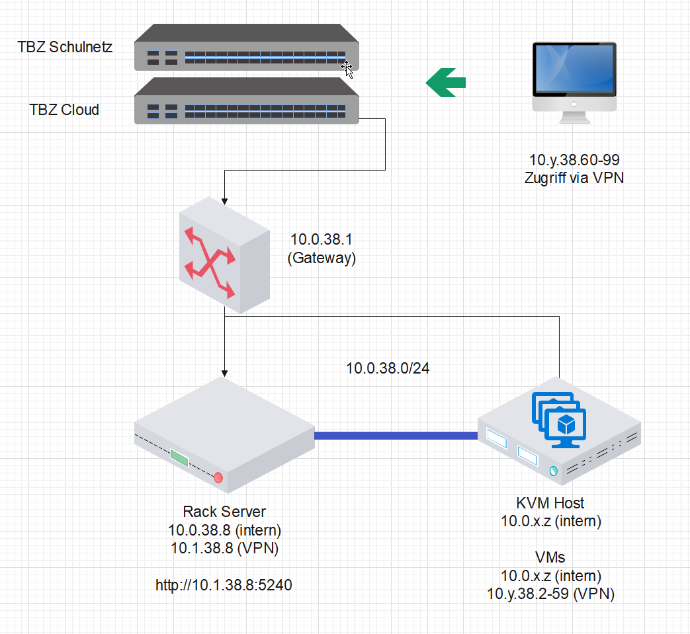

# DE3
*Ich kann VPN mittels Metadata konfigurieren*

## Einleitung VPN

*VPN steht für "Virtual Private Network" und beschreibt die Möglichkeit eine geschützte Netzwerkverbindung unter Nutzung öffentlicher Netzwerke aufzubauen. VPNs verschlüsseln Ihren Internetverkehr und verschleiern Ihre Online-Identität. ... Die Verschlüsselung findet dabei in Echtzeit statt.* [^1]

Vorteile:
- Sichere Verschlüsselung
- Verschleierung Ihres Aufenthaltsorts
- Zugriff auf regionale Inhalte
- Sicherer Datentransfer

Abbild VPN Overview:

Abbild von unserer Anlage:

## Installation VPN Wire Guard

Die Konfigurationsdateien für unser VPN sind auf dem VPN Gateway der TBZ gespeichert.
Dies wurde durch den Modulleiter vorbereitet.

- Adresse des VPN Gateway ist 10.0.40.8
- Die Dateien befinden sich im Verzeichnis /data/config/
- Die Dateien sind u.a. im TAR Format abgelegt, die Namensgebung entspricht dem Netzwerk, z.B. wg1.38.tag = 10.1.38.0/24

1. `sudo apt install y wireguard nfs common openssh server`

2. `mkdir config`

3. `sudo mount t nfs 10.0.40.8:/ data config config` # Gateway mit Konfigurationsdatein

4. `tar xvzf config wireguard / wg <Eure Gruppe N>.38.tgz 08.conf`

5. `sudo mv 08.conf / etc wireguard /wg0.conf`

6. `sudo systemctl enable wg quick@wg0.service`

7. `sudo systemctl start wg quick@wg0.service`       

## Einrichtung VPN per Cloud-init

## Einrichtung VPN per Metadata

Egal ob Azure, AWS, Privat Cloud (MAAS) stellt jede davon sogenannte Metadaten zur Verfügung.

Diese Informationen brauchen wir für:
- VPN einzurichten
- Spezifische Software zu installieren
- Cloud-init Scripts zu Parametrisieren

Mittels diesen Metadata können Informationen wie Cloud Region, Computer Name, Betriebssystem etc. ausgelesen werden.

### Azure
*Der Azure Instance Metadata Service (IMDS) liefert Informationen über die aktuell ausgeführten Instanzen virtueller Maschinen. Sie können ihn verwenden, um Ihre virtuellen Maschinen zu verwalten und zu konfigurieren. Diese Informationen umfassen die SKU, den Speicher, die Netzwerkkonfigurationen und anstehende Wartungsereignisse. Eine vollständige Liste der verfügbaren Daten finden Sie in der Zusammenfassung der Endpunktkategorien.*

*IMDS ist für laufende Instanzen virtueller Maschinen (VMs) und Instanzen von Skalierungssätzen für virtuelle Maschinen verfügbar. Alle Endpunkte unterstützen VMs, die mit dem Azure Resource Manager erstellt und verwaltet werden. Nur die Kategorie Attested und der Netzwerkteil der Kategorie Instance unterstützen VMs, die mit dem klassischen Bereitstellungsmodell erstellt wurden. Der Endpunkt Attested unterstützt dies nur in begrenztem Umfang.*

*IMDS ist eine REST-API, die unter einer bekannten, nicht routingfähigen IP-Adresse (169.254.169.254) verfügbar ist. Sie können nur innerhalb der VM darauf zugreifen. Die Kommunikation zwischen der VM und IMDS verlässt niemals den Host. Lassen Sie Ihre HTTP-Clients Web-Proxies innerhalb der VM umgehen, wenn Sie IMDS abfragen, und behandeln Sie 169.254.169.254 genauso wie 168.63.129.16.*

Um auf IMDS zuzugreifen, erstellt man eine VM über Azure Ressource Manager oder das Azure Portal und verwenden das folgende Beispiel. Hier ist ein Beispielcode zum Abrufen aller Metadaten für eine Instanz.

`curl -H Metadata:true --noproxy "*" "http://169.254.169.254/metadata/instance?api-version=2021-02-01" | jq`

[Azure Instance Metadata Service](https://docs.microsoft.com/en-us/azure/virtual-machines/windows/instance-metadata-service?tabs=linux)

### AWS

Erzeugen Sie zunächst ein Token mit dem folgenden Befehl.
                TOKEN=`curl -X PUT "http://169.254.169.254/latest/api/token" -H "X-aws-ec2-metadata-token-ttl-seconds: 21600"

Verwenden Sie dann das Token, um mit dem folgenden Befehl Metadatenelemente der obersten Ebene zu erzeugen.
                curl -H "X-aws-ec2-metadata-token: $TOKEN" -v http://169.254.169.254/latest/meta-data/

[Instance metadata and user data](https://docs.aws.amazon.com/AWSEC2/latest/UserGuide/ec2-instance-metadata.html)

### MAAS

Da bei AWS und Azure dies intern zur verfügung steht, muss dies beim MAAS über [Curtins](https://curtin.readthedocs.io/en/latest/topics/config.html) gemacht werden.

___

[Nächstes Lernziel DE4](../04_Private-Cloud/DE4.md)

[04_Private-Cloud](../04_Private-Cloud)

[Startseite](https://github.com/ask-yo-girl-about-me/Project-Future)

[^1]: Was ist VPN und wie funktioniert es? [Kaspersky](https://www.kaspersky.de/resource-center/definitions/what-is-a-vpn)