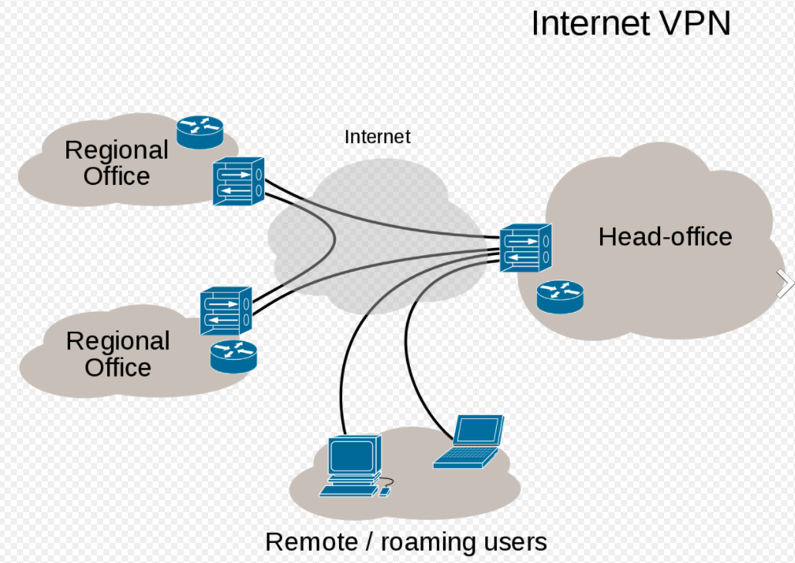

# DE3
*Ich kann VPN mittels Metadata konfigurieren*

## Einleitung VPN

*VPN steht für "Virtual Private Network" und beschreibt die Möglichkeit eine geschützte Netzwerkverbindung unter Nutzung öffentlicher Netzwerke aufzubauen. VPNs verschlüsseln Ihren Internetverkehr und verschleiern Ihre Online-Identität. ... Die Verschlüsselung findet dabei in Echtzeit statt.* [^1]

Vorteile:
- Sichere Verschlüsselung
- Verschleierung Ihres Aufenthaltsorts
- Zugriff auf regionale Inhalte
- Sicherer Datentransfer

Abbild VPN Overview:

Abbild von unserer Anlage:

## Installation VPN Wire Guard

Die Konfigurationsdateien für unser VPN sind auf dem VPN Gateway der TBZ gespeichert.
Dies wurde durch den Modulleiter vorbereitet.

- Adresse des VPN Gateway ist 10.0.40.8
- Die Dateien befinden sich im Verzeichnis /data/config/
- Die Dateien sind u.a. im TAR Format abgelegt, die Namensgebung entspricht dem Netzwerk, z.B. wg1.38.tag = 10.1.38.0/24

1. `sudo apt install y wireguard nfs common openssh server`

2. `mkdir config`

3. `sudo mount t nfs 10.0.40.8:/ data config config` # Gateway mit Konfigurationsdatein

4. `tar xvzf config wireguard / wg <Eure Gruppe N>.38.tgz 08.conf`

5. `sudo mv 08.conf / etc wireguard /wg0.conf`

6. `sudo systemctl enable wg quick@wg0.service`

7. `sudo systemctl start wg quick@wg0.service`       

## Einrichtung VPN per Cloud-init

## Einrichtung VPN per Metadata

___

[Nächstes Lernziel DE4](../04_Private-Cloud/DE4.md)

[04_Private-Cloud](../04_Private-Cloud)

[Startseite](https://github.com/ask-yo-girl-about-me/Project-Future)

[^1]: Was ist VPN und wie funktioniert es? [Kaspersky](https://www.kaspersky.de/resource-center/definitions/what-is-a-vpn)