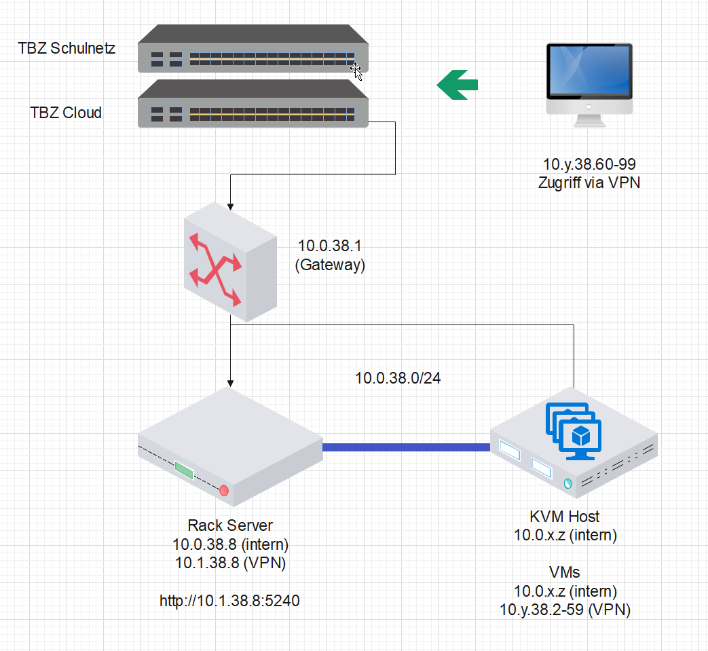
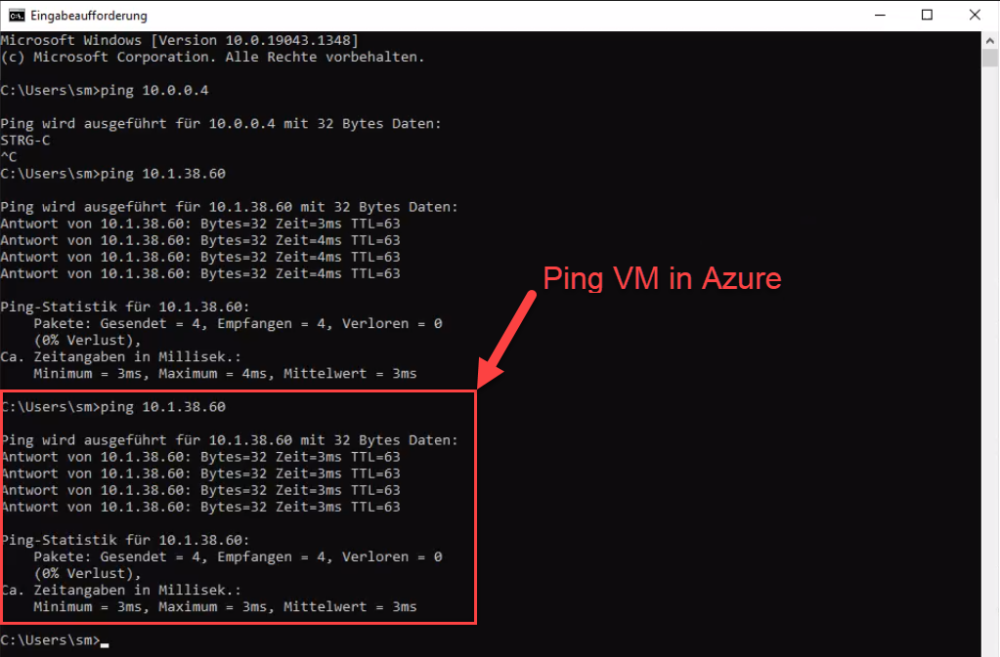
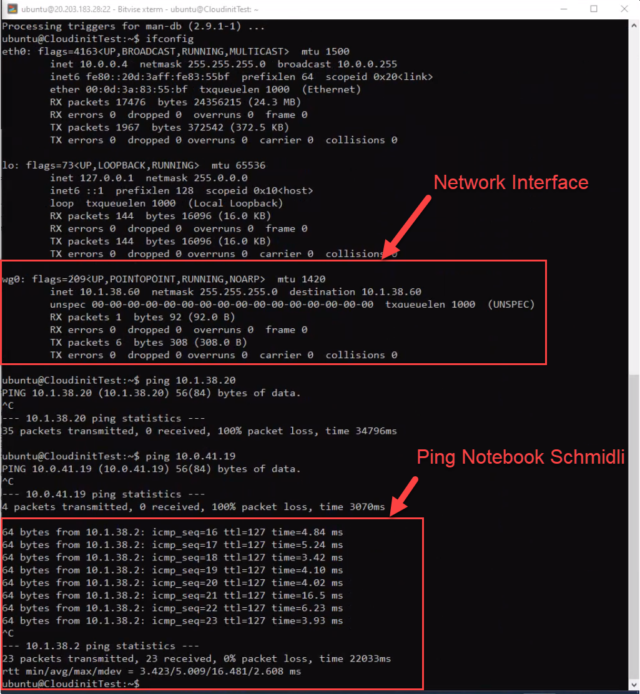
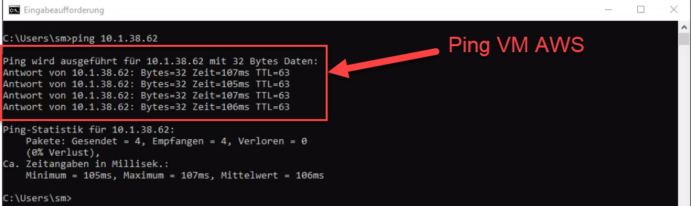
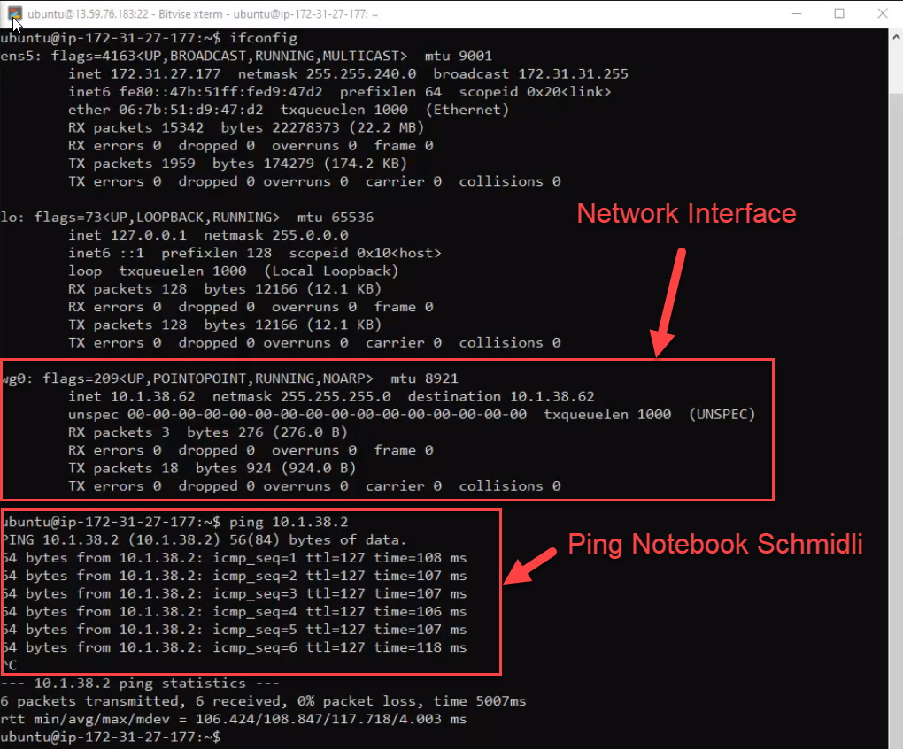
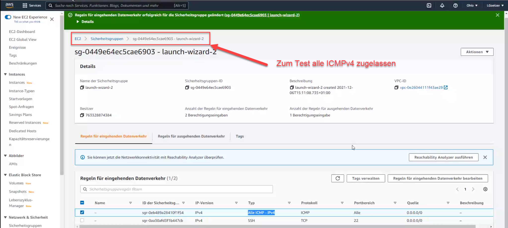

# DE4
*Ich kann eine abgesicherte Multicloud Umgebung aufsetzen*

## Einleitung VPN

*VPN steht für "Virtual Private Network" und beschreibt die Möglichkeit eine geschützte Netzwerkverbindung unter Nutzung öffentlicher Netzwerke aufzubauen. VPNs verschlüsseln Ihren Internetverkehr und verschleiern Ihre Online-Identität. ... Die Verschlüsselung findet dabei in Echtzeit statt.* [^1]

Vorteile:
- Sichere Verschlüsselung
- Verschleierung Ihres Aufenthaltsorts
- Zugriff auf regionale Inhalte
- Sicherer Datentransfer

Abbild VPN Overview:

Abbild von unserer Anlage:

## Installation VPN Wire Guard

Die Konfigurationsdateien für unser VPN sind auf dem VPN Gateway der TBZ gespeichert.
Dies wurde durch den Modulleiter vorbereitet.

- Adresse des VPN Gateway ist 10.0.40.8
- Die Dateien befinden sich im Verzeichnis /data/config/
- Die Dateien sind u.a. im TAR Format abgelegt, die Namensgebung entspricht dem Netzwerk, z.B. wg1.38.tag = 10.1.38.0/24

1. `sudo apt install y wireguard nfs common openssh server`

2. `mkdir config`

3. `sudo mount t nfs 10.0.40.8:/ data config config` # Gateway mit Konfigurationsdatein

4. `tar xvzf config wireguard / wg <Eure Gruppe N>.38.tgz 08.conf`

5. `sudo mv 08.conf / etc wireguard /wg0.conf`

6. `sudo systemctl enable wg quick@wg0.service`

7. `sudo systemctl start wg quick@wg0.service`       

## Einrichtung VPN per Cloud-init

Wir haben auf der Azure Cloud, AWS Cloud und auf dem MAAs eine neue Virtuelle Maschine erstellt mit unserem Cloud-init File. Beim MAAS muss einfach ein Name definiert werden der nicht mit dem Namensschema vom Pressed/Curtins vom LernMAAS.

[Cloud-init_VPN_Azure.yml](https://github.com/ask-yo-girl-about-me/Project-Future/blob/main/04_Private-Cloud/Cloud-init/Cloud-init_VPN_Azure.yml)

                #cloud-config
                users:
                - name: ubuntu
                    sudo: ALL=(ALL) NOPASSWD:ALL
                    groups: users, admin
                    home: /home/ubuntu
                    shell: /bin/bash
                    lock_passwd: false
                    plain_text_passwd: 'password'        
                # login ssh and console with password
                ssh_pwauth: true
                disable_root: false    
                packages:
                - wireguard
                write_files:
                - content: |
                    [Interface]
                    Address = 10.1.38.20/24
                    PrivateKey = iAzmaXeVF4GFHDGhsRvYU2coI98ky0py91NDrZCqo1g=
                    [Peer]
                    PublicKey = 5mgqUiC9rkUqDkbw5VIzDDfhNldLAubivWyeun2ODxA=
                    Endpoint = cloud.tbz.ch:51901
                    AllowedIPs = 10.1.38.0/24
                    PersistentKeepalive = 25
                path: /etc/wireguard/wg0.conf
                permissions: '0640'
                runcmd:
                - sudo systemctl enable wg-quick@wg0.service
                - sudo systemctl start wg-quick@wg0.service

Das ganze wurde durch einen Ping getestet:

Notebook Schmidli / IP 10.1.38.2 `ping 10.1.38.60`

VM Azure / IP 10.1.38.60 `ping 10.1.38.2`

[Cloud-init_VPN_AWS.yml](https://github.com/ask-yo-girl-about-me/Project-Future/blob/main/04_Private-Cloud/Cloud-init/Cloud-init_VPN_AWS.yml)

                #cloud-config
                users:
                - name: ubuntu
                    sudo: ALL=(ALL) NOPASSWD:ALL
                    groups: users, admin
                    home: /home/ubuntu
                    shell: /bin/bash
                    lock_passwd: false
                    plain_text_passwd: 'password'        
                # login ssh and console with password
                ssh_pwauth: true
                disable_root: false    
                packages:
                - wireguard
                write_files:
                - content: |
                    [Interface]
                    Address = 10.1.38.62/24
                    PrivateKey = GLP5zN8ViWFx7idDokYR8UaHfkXnd02JH61yajhmI0I=
                    [Peer]
                    PublicKey = 5mgqUiC9rkUqDkbw5VIzDDfhNldLAubivWyeun2ODxA=
                    Endpoint = cloud.tbz.ch:51901
                    AllowedIPs = 10.1.38.0/24
                    PersistentKeepalive = 25
                path: /etc/wireguard/wg0.conf
                permissions: '0640'
                runcmd:
                - sudo systemctl enable wg-quick@wg0.service
                - sudo systemctl start wg-quick@wg0.service

Notebook Schmidli / IP 10.1.38.2 `ping 10.1.38.62`

VM AWS / IP 10.1.38.62 `ping 10.1.38.2`

Damit dies aber funktionierte mussten wir Testweise die Sicherheitsregenln anpassen.

___

[Nächstes Lernziel EE1](../04_Private-Cloud/EE1.md)

[04_Private-Cloud](../04_Private-Cloud)

[Startseite](https://github.com/ask-yo-girl-about-me/Project-Future)

[^1]: Was ist VPN und wie funktioniert es? [Kaspersky](https://www.kaspersky.de/resource-center/definitions/what-is-a-vpn)