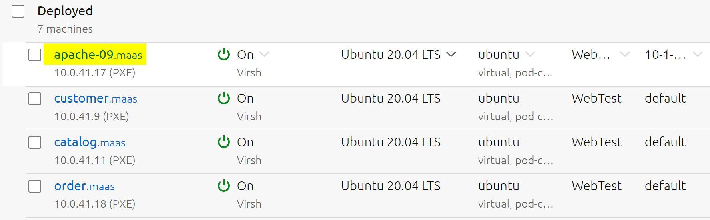
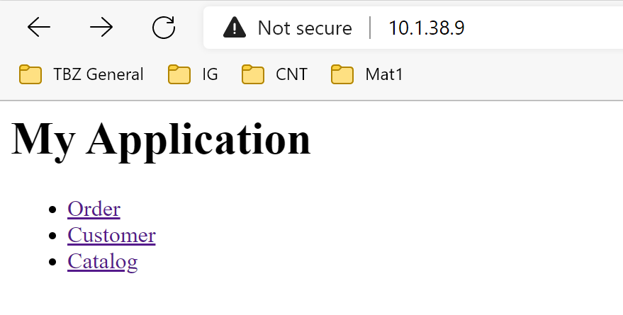

# EE1
*Ich kann die Service Discovery Umsetzungen einsetzen und dokumentieren*

Service Disovery beschreibt den Prozess das sich Dienste selber miteinander verbinden. 
Dabei wird angenommen das die VM's untereinander schon verbunden sind. 

Weitere Funktionen von Service Discovery können sein:

- Health Checking
- Failover
- Load Balancing
- Verschlüsselung der übertragenen Daten
- Isolieren von VM Gruppen

## Beispiel

Ein Beispiel wäre der Webshop einer Firma, die Datenbank kann intern bleiben, muss nicht direkt von aussen erreichbar sein, der Webshop welcher das Frontend für den Kunden darstellt hingegen schon. Somit greifen die Kunden via dem Frontend, Webseite, auf die Datenbank zu. 

Wir haben dazu die [Beispielapplikation](https://gitlab.com/ch-tbz-hf/Stud/cnt/-/tree/main/2_Unterrichtsressourcen/E#beispielapplikation) verwendet und auf unserer MAAS Umgebung aufgesetzt. 

3 VMs wurde eingerichtet, Order, Customer und Catalag.

Order:

                #cloud-config
                packages:
                - nginx
                write_files:
                - content: |
                    <html>
                    <body>
                    <h1>Order App</h1>
                    </body>
                    </html>
                path: /var/www/html/index.html
                permissions: '0644'

Customer:

                #cloud-config
                packages:
                - nginx
                write_files:
                - content: |
                    <html>
                    <body>
                    <h1>Customer App</h1>
                    </body>
                    </html>
                path: /var/www/html/index.html
                permissions: '0644'

Catalog:

                #cloud-config
                packages:
                - nginx
                write_files:
                - content: |
                    <html>
                    <body>
                    <h1>Catalog App</h1>
                    </body>
                    </html>
                path: /var/www/html/index.html
                permissions: '0644'   

# Portmapping - port-based-routing
*Eine Portweiterleitung ist die Weiterleitung einer Verbindung, die über ein Rechnernetz auf einem bestimmten Port eingeht, zu einem anderen Computer.*

*Die eingehenden Datenpakete werden hierbei per Destination NAT und die ausgehenden Pakete per Source NAT maskiert (die Ziel- und Quelladressen ersetzt), um die Anfrage an den tatsächlichen Server und dessen Antwort an den ursprünglichen Client weiterzuleiten. Für Server und Client entsteht so der Anschein, die eingehenden Pakete stammten von dem Computer, der die Portweiterleitung betreibt.*

*Port Forwarding wird oft dazu benutzt, FTP, Web-Server oder andere Server-basierende Anwendungen hinter einem NAT-Gateway zu betreiben.*[^1]

Wir haben uns aber in der Übung auf den Reverse Proxy bezogen.

# Reverse Proxy 
Ein Reverse-Proxy ist ein Proxy in einem Rechnernetz, der Ressourcen für einen externen Client von einem oder mehreren internen Servern holt. Die Umsetzung der Adresse ist atypisch und der Richtung des Aufrufes entgegengesetzt (deutsch „umgekehrter Proxy“).Die wahre Adresse des internen Zielsystems bleibt dem externen Client verborgen. Das unterscheidet ihn vom typischen (Forward-)Proxy, der mehreren Clients eines internen (in sich abgeschlossenen) Netzes den Zugriff auf ein externes Netz gewährt.[^2]

Da der Name unserer VM auf 09 endet, kriegt sie auch die IP [http://10.1.38.9/ ](http://10.1.38.9/)

Somit können wir über diese IP auf den Apache connecten. Durch die Service Discover wurden die 3 Datenbanken discovered und werden nun so anegzeigt. 

___

[Nächstes Lernziel FE1](../04_Private-Cloud/FE1.md)

[04_Private-Cloud](../04_Private-Cloud)

[Startseite](https://github.com/ask-yo-girl-about-me/Project-Future)

[^1]: Portmapping [Wikipedia](https://de.wikipedia.org/wiki/Portweiterleitung)

[^2]: Revers-Proxy [Wikipedia](https://de.wikipedia.org/wiki/Reverse_Proxy)