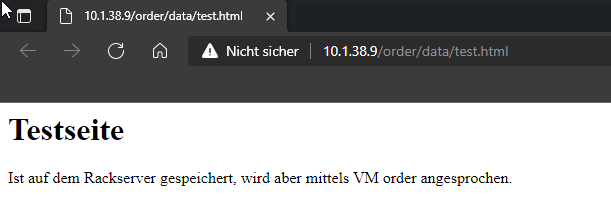

# FE1
*Ich kann Persistenz und Sicherung der Daten implementieren und dokumentieren*

## Persistenz

Die Idee der Persistenten Daten ist, das diese auch nach einem Reboot oder Unterbruch noch vorhanden sind. Deswegen werden die auch an statischen Orten abgespeichert wie zbsp. auf einer Festplatte oder einer Datenbank. 

Daten welche Persistenz sind, sind in der Regel nur auf einer VM vorhanden, deswegen ist es auch wichtig das diese gesichert werden. 

## Installation und Konfiguration

Als Grundlage der Anlage werden hier die VMs vom Kapitel [Portmapping / Reverse Proxy](https://gitlab.com/ch-tbz-hf/Stud/cnt/-/tree/main/2_Unterrichtsressourcen/E) verwendet.

Wir richten auf dem Rack Server eine Persistenze Ablage für unsere VMs ein. Dazu wir Network File System verwendet. Dies ist ein von Sun Microsystems entwickeltes Protokoll, das den Zugriff auf Dateien über ein Netzwerk ermöglicht.

Die Installation funktioniert wie folgt:

                sudo apt-get update
                sudo apt install -y nfs-kernel-server

Als Ablageort erstellen wir ein Verzeichnis `/data/storage` und legen die Zugriffsrechte fest.

                sudo mkdir -p /data /data/storage
                sudo chown -R ubuntu:ubuntu /data
                sudo chmod 777 /data/storage

Die Konfiguration von NFS erfolgt in der Datei `/etc/exports`. Dort ist /data/storage und das erlaubte Subnetz einzutragen.

                cat <<%EOF% | sudo tee /etc/exports
                # /etc/exports: the access control list for filesystems which may be exported
                #               to NFS clients.  See exports(5).
                # Storage RW
                /data/storage 10.0.45.0/24(rw,sync,no_subtree_check,all_squash,anonuid=1000,anongid=1000)
                %EOF%

---
**INFO**

das Subnetz 10.0.45.0/24 wurde auf unseres eigenes Subnetz 10.0.41.0/24

---

Zum Schluss, muss NFS neu gestartet werden:

                sudo exportfs -a
                sudo systemctl restart nfs-kernel-server

Damit VMs Dateien auf dem Rack Server ablegen können, ist das Cloud-init Script zu erweitern. Dieses sieht für order dann so aus:

[Clou-init_Order](../04_Private-Cloud/Cloud-init/Cloud-init_Orderyml)

                #cloud-config
                packages:
                - apache2 
                - nfs-client
                write_files:
                - content: |
                    <html>
                    <body>
                    <h1>Order</h1>
                    
<a href="/order/data/test.html">Daten</a>

                    </body>
                    </html>
                path: /var/www/html/index.html
                permissions: '0644'
                runcmd:
                - sudo mkdir /var/www/html/data
                - sudo chown ubuntu:ubuntu /var/www/html/data
                - sudo mount -t nfs 10.0.45.8:/data/storage /var/www/html/data

---
**INFO**

Auf der letzten Zeile, mountet die VM das Verzeichnis /data/storage des Racks Server. Die IP-Adresse 10.0.45.8 ist, für das eigene Rack auf 10.0.41.8 angepasst worden.

---

Wenn wir uns jetzt mit dem Rack Server verbinden, dort im Verzeichnis /data/storage eine Datei anlegen, muss diese via Reverse Proxy sichtbar sein.

Beispiel Datei:

                ssh ubuntu@10.0.45.8
                cat <<%EOF% >/data/storage/test.html
                    <html>
                    <body>
                    <h1>Testseite</h1>
                    
Ist auf dem Rackserver gespeichert, wird aber 
                    mittels VM order angesprochen.

                    </body>
                    </html>
                %EOF%

Um das ganze zu testen geht man wie folgt vor:

Aufruf des Reverse Proxy, bzw. der Order VM
                http://<IP Reverse Proxy/order/data/test.hml

---
**INFO**

Hinweis: um die NFS Verbindung auch nach dem Reboot der VM verfügbar zu haben, sollte der Mount in die Datei `/etc/fstab`, in der VM, eingetragen werden.

---

___

[04_Private-Cloud](../04_Private-Cloud)

[Startseite](https://github.com/ask-yo-girl-about-me/Project-Future)