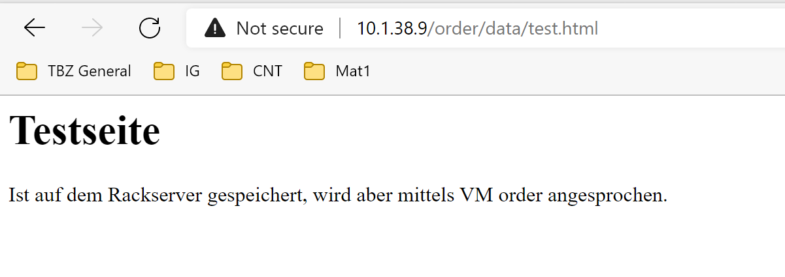

# FE1
*Ich kann Persistenz und Sicherung der Daten implementieren und dokumentieren*

## Persistenz

Die Idee der Persistenten Daten ist, das diese auch nach einem Reboot oder Unterbruch noch vorhanden sind. Deswegen werden die auch an statischen Orten abgespeichert wie zbsp. auf einer Festplatte oder einer Datenbank. 

Daten welche Persistenz sind, sind in der Regel nur auf einer VM vorhanden, deswegen ist es auch wichtig das diese gesichert werden. 

### Beispiel

Wir haben den persisteten Datenspeicher wie [hier](https://gitlab.com/ch-tbz-hf/Stud/cnt/-/tree/main/2_Unterrichtsressourcen/F) beschrieben umgesetzt. 
Wenn wir nun die Order Datenbank auswählen können wir die erstellte Order Datei anschauen, welche auf dem persistenten Speicher liegt: 

___

[04_Private-Cloud](../04_Private-Cloud)

[Startseite](https://github.com/ask-yo-girl-about-me/Project-Future)
